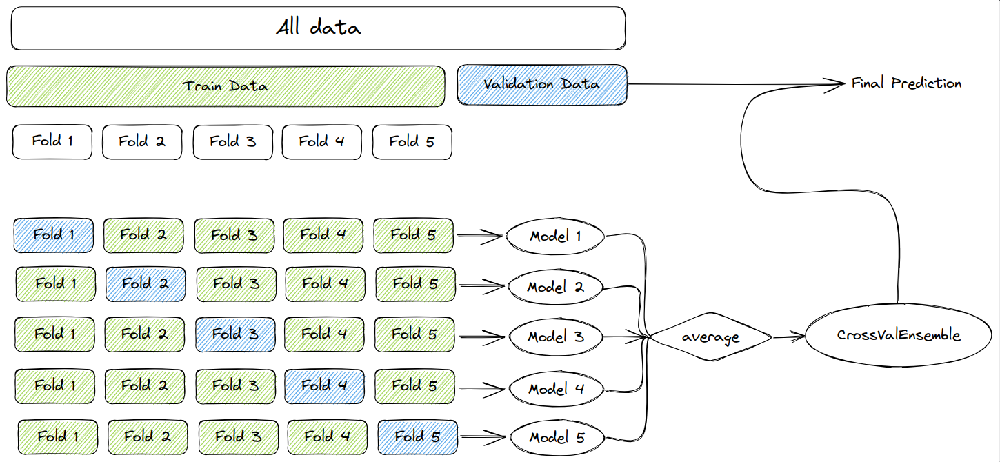

**crossval-ensemble** is a Python module for machine learning built on top of
sklearn and is distributed under the 3-Clause BSD license.

It allows to create complex ensemble models, leveraging sklearn pipelines with `fit` / `predict` methods.

Cross Validation Ensembling consists in training `k` early stopped models on a single training set, and ensembling them via prediction averaging.

The benefits are :
* making use of the whole training set, without needing a validation set for early stopping
* leveraging ensemble modelling / stacking to decrease variance

The costs are :
* increased training time
* increased prediction time

# Installation

## Dependencies

crossval-ensemble requires:

- Python (>= 3.6)
- Pandas (>=2.0.3)
- Scikit-Learn (>=1.3.0)
- Sklearn-Pandas (>=2.2.0)
- Tqdm (>=4.65.0)
- Python-Dotenv (>=1.0.0)
- Flake8 (>=6.0.0)
- Ipywidget (>=8.0.6)-
- Catboost (>=1.2)
- Xgboost (>=1.7.6)
- Lightgbm (>=3.3.5)

## User installation

The easiest way to install crossval-ensemble is using ``pip``:

    pip install -U crossval-ensemble

# Source code

You can check the latest sources with the command:

    git clone https://github.com/Liberkeys/crossval-ensemble